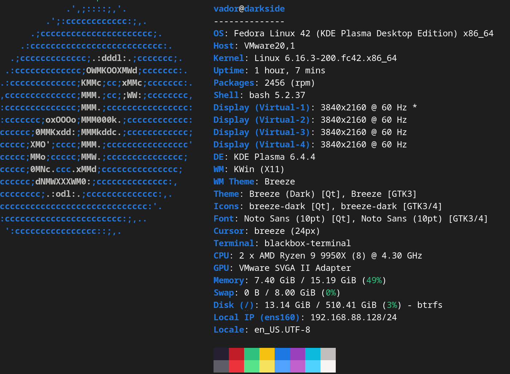

# Microsoft Development Stack Setup for Fedora 42 KDE Plasma (VMware)

A comprehensive, production-ready script to set up a complete Microsoft development environment on Fedora 42 KDE Plasma under VMware. This script installs and configures all essential tools for modern development with Microsoft technologies, optimized for the KDE desktop environment and VMware virtualization platform.

## 🖥️ Target System



*Fedora 42 KDE Plasma running under VMware with fastfetch system information*

## 🚀 Quick Start

```bash
# Clone the repository
git clone https://github.com/galactic-plane/fedora-42-kde-vmware-setup.git
cd fedora-42-kde-vmware-setup

# Make the script executable
chmod +x ms-dev-setup-script.sh

# Run the setup (requires sudo)
sudo ./ms-dev-setup-script.sh
```

## 📋 What Gets Installed

### Core Microsoft Stack
- **Visual Studio Code** - Premier code editor with extensions ecosystem
- **Microsoft Edge** - Modern web browser with developer tools
- **.NET 9 SDK** - Latest .NET development platform
- **Azure CLI** - Command-line tools for Azure cloud services
- **Power Platform CLI** - Tools for Power Platform development

### Development Tools
- **Git** - Version control system
- **Node.js & npm** - JavaScript runtime and package manager
- **Python 3 & pip** - Python development environment
- **Podman** - Container management (Docker alternative, KDE integrated)

### System Tools
- **htop** - Interactive process viewer
- **iotop** - I/O monitoring tool
- **sysstat** - System performance tools
- **net-tools** - Network utilities
- **nethogs** - Network bandwidth monitor
- **mesa-utils** - Graphics utilities (VMware 3D acceleration support)

## ✨ Features

### 🔒 Security & Reliability
- **Privilege validation** - Ensures script runs with proper permissions
- **System validation** - Verifies Fedora compatibility and network connectivity
- **Interactive confirmation** - Shows complete software list before installation
- **User consent** - Allows users to review and approve before making changes
- **File backups** - Automatically backs up modified system files
- **Input validation** - Validates downloaded files before installation
- **Error handling** - Graceful failure handling with detailed error messages

### 🔧 Smart Configuration
- **Dynamic version detection** - Automatically detects Fedora version (optimized for v42)
- **KDE Plasma integration** - Configures tools for optimal KDE experience
- **VMware optimization** - Includes VMware Tools verification and 3D acceleration checks
- **Idempotent execution** - Safe to run multiple times
- **Duplicate prevention** - Prevents duplicate PATH entries and aliases
- **Repository management** - Safely manages Microsoft package repositories

### 📊 Comprehensive Logging
- **Activity logging** - All actions logged to `/var/log/ms-dev-setup.log`
- **Progress indicators** - Clear visual feedback during installation
- **Version reporting** - Detailed summary of installed software versions
- **System information** - Hardware and system configuration report

## 🛠️ System Requirements

- **Operating System**: Fedora 42 (specifically tested)
- **Desktop Environment**: KDE Plasma (optimized for)
- **Virtualization**: VMware Workstation/Player (includes VMware Tools integration)
- **Architecture**: x86_64
- **Privileges**: Root access (sudo)
- **Network**: Internet connectivity to Microsoft repositories
- **Disk Space**: ~2GB free space for installations

## 📖 Usage

### Basic Usage
```bash
sudo ./ms-dev-setup-script.sh
```

The script will:
1. **Validate system requirements** (Fedora compatibility, network connectivity)
2. **Display comprehensive software list** with categories and estimated sizes
3. **Request user confirmation** before making any changes
4. **Proceed with installation** only after user approval
5. **Provide detailed progress updates** throughout the process
6. **Generate final summary** with all installed software versions

### Post-Installation Steps
After the script completes, run these commands as your regular user (not root):

```bash
# Enable Podman socket for container management
systemctl --user enable --now podman.socket

# Trust .NET HTTPS development certificate
dotnet dev-certs https --trust

# Reload shell configuration
source ~/.bashrc
```

### Verification
Check that everything is working:
```bash
# Test installed tools
code --version
microsoft-edge --version
dotnet --version
az --version
pac help

# Test development workflow
dotnet new console -n TestApp
cd TestApp
dotnet run
```

### What You'll See
When you run the script, you'll get an interactive experience:

```
==========================================
📦 SOFTWARE TO BE INSTALLED/UPDATED
==========================================

🔧 SYSTEM UPDATES:
   • System package updates
   • Firmware updates (skipped for VMs)

🛠️  DEVELOPMENT TOOLS:
   • Git (version control)
   • Node.js (JavaScript runtime)
   • npm (Node.js package manager)
   • Python 3 with pip (Python package manager)
   • Podman (container management)

🏢 MICROSOFT DEVELOPMENT STACK:
   • Visual Studio Code (code editor)
   • Microsoft Edge (web browser)
   • .NET 9 SDK (development framework)

... [full list] ...

📁 ESTIMATED DOWNLOAD SIZE: ~1-2 GB
💾 ESTIMATED DISK SPACE NEEDED: ~3-4 GB

🤔 Do you want to proceed with the installation? [Y/n]:
```

## 📁 Project Structure

```
fedora-setup/
├── ms-dev-setup-script.sh     # Main installation script
├── README.md                  # This documentation
└── .git/                      # Git repository data
```

## 🔍 Script Architecture

### Function Overview
- `check_privileges()` - Validates root permissions
- `validate_system()` - Checks Fedora compatibility and connectivity
- `get_fedora_version()` - Dynamically detects Fedora version
- `backup_file()` - Creates timestamped backups
- `log_action()` - Logs activities with timestamps
- `add_microsoft_repo()` - Safely adds Microsoft repositories
- `command_exists()` - Checks if commands are available
- `package_installed()` - Verifies package installation

### Installation Steps
1. **System Updates** - Updates all system packages and Fedora 42 specific components
2. **Development Tools** - Installs essential development utilities optimized for KDE
3. **Microsoft Repositories** - Configures Microsoft package sources
4. **Microsoft Applications** - Installs VS Code, Edge, and .NET with KDE integration
5. **Azure Tools** - Installs Azure CLI and Functions Core Tools
6. **Power Platform** - Installs Power Platform CLI
7. **System Configuration** - Configures PATH, aliases, and certificates for KDE
8. **VMware Integration** - Verifies VMware Tools and 3D acceleration support

## 🚨 Troubleshooting

### Common Issues

**Permission Denied**
```bash
# Ensure script is executable
chmod +x ms-dev-setup-script.sh

# Run with sudo
sudo ./ms-dev-setup-script.sh
```

**Network Issues**
```bash
# Check internet connectivity
ping packages.microsoft.com

# Check DNS resolution (VMware NAT specific)
nslookup packages.microsoft.com

# Test VMware network adapter
ip addr show ens33
```

**Repository Conflicts**
```bash
# Clear DNF cache
sudo dnf clean all

# Rebuild cache
sudo dnf makecache
```

### Log Analysis
Check the detailed log for troubleshooting:
```bash
sudo tail -f /var/log/ms-dev-setup.log
```

### Manual Package Installation
If any package fails to install automatically:
```bash
# Azure Functions Core Tools
npm install -g azure-functions-core-tools@4

# Individual Microsoft packages
sudo dnf install code
sudo dnf install microsoft-edge-stable
sudo dnf install dotnet-sdk-9.0
```

## 🔄 Updates and Maintenance

### Updating the Script
```bash
git pull origin main
sudo ./ms-dev-setup-script.sh
```

### Keeping Software Updated
```bash
# Update system packages
sudo dnf update

# Update .NET tools
dotnet tool update -g --all

# Update npm packages
npm update -g
```

## 🤝 Contributing

1. Fork the repository
2. Create a feature branch (`git checkout -b feature/amazing-feature`)
3. Commit your changes (`git commit -m 'Add some amazing feature'`)
4. Push to the branch (`git push origin feature/amazing-feature`)
5. Open a Pull Request

### Development Guidelines
- Test on clean Fedora 42 KDE Plasma installations
- Verify VMware Tools compatibility
- Follow bash best practices
- Add logging for new features
- Update documentation
- Ensure idempotent operations
- Test KDE integration features

## 📝 Changelog

### v2.1.0 (Current)
- ✅ Added interactive software list with user confirmation
- ✅ Enhanced user experience with detailed software breakdown
- ✅ Added estimated download sizes and disk space requirements
- ✅ Improved cancellation handling with graceful exit
- ✅ Added comprehensive pre-installation review process

### v2.0.0 (Previous)
- ✅ Added comprehensive security validations
- ✅ Implemented dynamic Fedora version detection
- ✅ Enhanced error handling and logging
- ✅ Fixed privilege escalation issues
- ✅ Added file backup functionality
- ✅ Improved repository management
- ✅ Enhanced version detection

### v1.0.0 (Legacy)
- Basic installation script
- Manual configuration required
- Limited error handling

## 📄 License

This project is licensed under the MIT License - see the [LICENSE](LICENSE) file for details.

## 🙏 Acknowledgments

- Microsoft for providing excellent development tools on Linux
- Fedora Project for the robust Linux distribution and KDE Plasma integration
- VMware for excellent Linux virtualization support
- KDE Community for the outstanding Plasma desktop environment
- Contributors and testers who helped improve this script

## 📞 Support

- **Issues**: Report bugs and request features via GitHub Issues
- **Documentation**: Check this README and inline script comments
- **Community**: Join discussions in GitHub Discussions
- **VMware-specific issues**: Check VMware Tools status and 3D acceleration

---

**Made with ❤️ for the Fedora 42 KDE Plasma and Microsoft development community**
